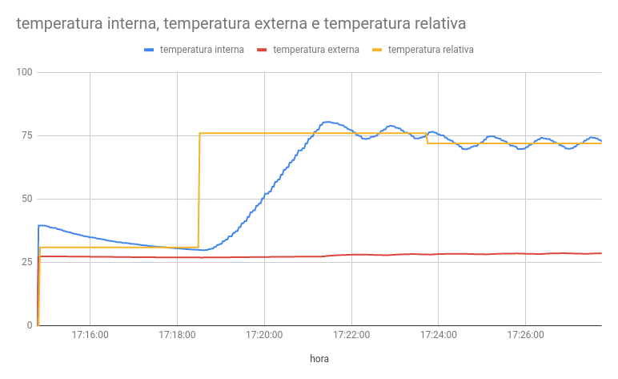
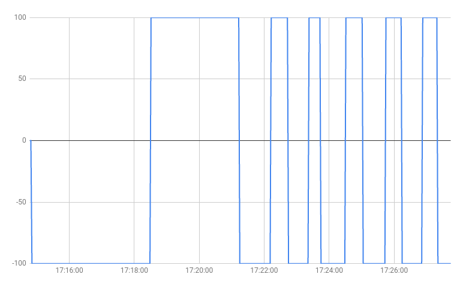
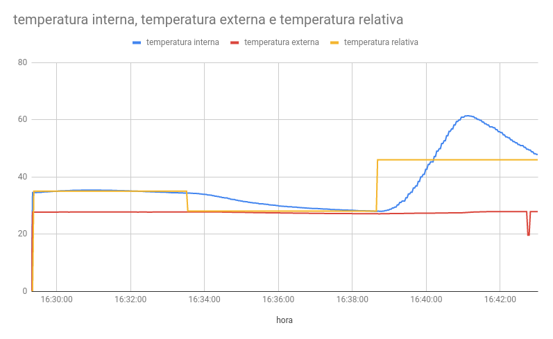
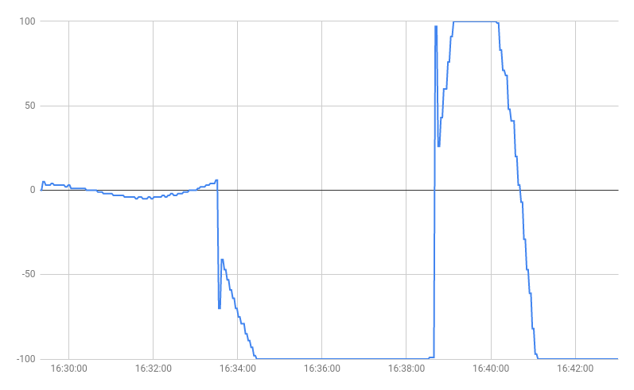

# Trabalho 1 - FSE

## Introdução

Esse projeto diz respeito ao trabalho 1 da disciplina de Fundamentos de Sistemas Embarcados da Faculdade do Gama (UnB), do semestre 2020/1.

## Informações do aluno

|Nome|Matrícula|git|
|----|---------|---|
|Pedro Henrique Andrade Féo|17/0020461|phe0|

## Como rodar o código

### Compilando

Para compilar o código é necessário utilizar um ambiente raspberryPi, com gcc e make instalado. Tendo esses requisitos cumpridos, basta utilizar o comando abaixo na raiz do pojeto para compilar o código.

```bash
make
```

### Executando

Depois que tiver o projeto compilado, basta usar o comando abaixo na raiz do projeto para começar a utiliza-lo.

```bash
./prog
```

## Módulos do código

O código é composto por um conjunto de módulos com responsábilidades diferentes. Sendo eles:

 - bme280: responsável pela comunicação com o sensor bme280;
 - crc: resposável por calcular o crc para uso na comunicação uart com protocolo MODBUS;
 - error: responsável por tratar alguns erros esperados;
 - file: responsável por criar e manipular o arqivo csv gerado para o relatório de uso;
 - lcd: responsável por enviar informações para escrever no display lcd;
 - main: ponto central do código, responsável por manipular os demais pacotes;
 - menu: responsável por manipular o terminal para interação do usuário;
 - pid: responsável por calcular os valores utilizados no algoritmo PID;
 - pwm: responsável pela comunicação com a ventoinha e com o resistor;
 - uart: responsável pela comunicação com a esp32 via porta uart;

## Relatório

Os logs utilizados nesse relatório estão disponíveis na pasta /logs.

### On/Off

Para a realização desse relatório foram inseridos os seguintes dados:
 - Temperatura relativa: 40.00
 - Histerese: 2.00

#### Temperatura Interna, exterta e relativa



#### Sinal de controle



### PID

Para a realização desse relatório foram inseridos os seguintes dados:
 - Kp: 5.00
 - Ki: 1.00
 - Kd: 5.00

#### Temperatura Interna, exterta e relativa



#### Sinal de controle

